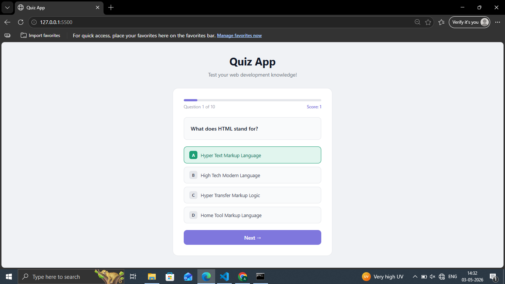
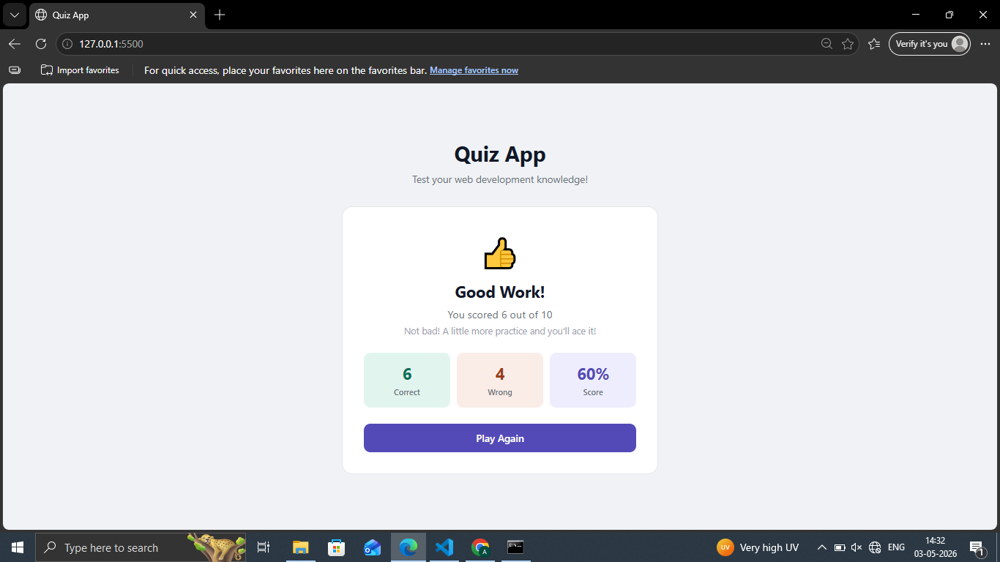

# Day 12 — Quiz App

A 10-question web development quiz with score tracking and result screen.

## Preview

## Features
- 10 web development questions
- Progress bar shows current position
- Green/red feedback on correct/wrong answers
- Live score counter
- Result screen with correct, wrong and percentage
- Different messages based on performance
- Play again button to restart

## Tech Stack
- HTML5
- CSS3 (transitions, dynamic classes)
- JavaScript (arrays, DOM manipulation, conditionals)

## What I Learned
- Dynamically rendering questions from a JS array
- Managing quiz state with variables
- Showing and hiding elements with display property
- Building a scoring system with conditionals

## Part of
[30 Days 30 Projects](https://github.com/anmisha-dash/30-days-30-projects) challenge